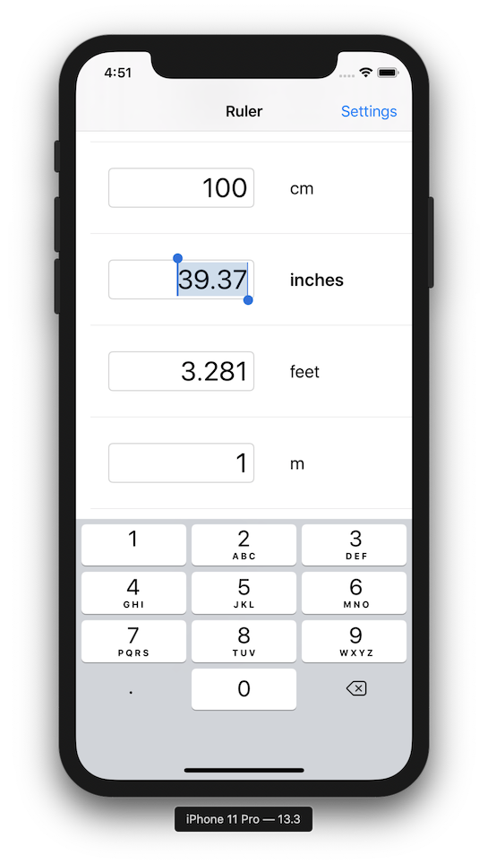

    
     
    Quickly convert between distance measurements

Ruler makes distance unit conversions simple and fast! When the app starts up, tap your unit in the list, enter a value, and instantly see the result in any other distance unit you want! If you need to paste the result in another app, just double-tap on the unit to copy the value to the clipboard!

## MVP

* Shows list of units
    * Click to select and bring up keyboard
    * Enter input
* All others update as numbers are entered
* Setting for how many decimal places

## Stretch

* Choose favorite units to pin to the top
* Sort or filter by Imperial / Metric
* Show rare units?
* Setting for default unit?
